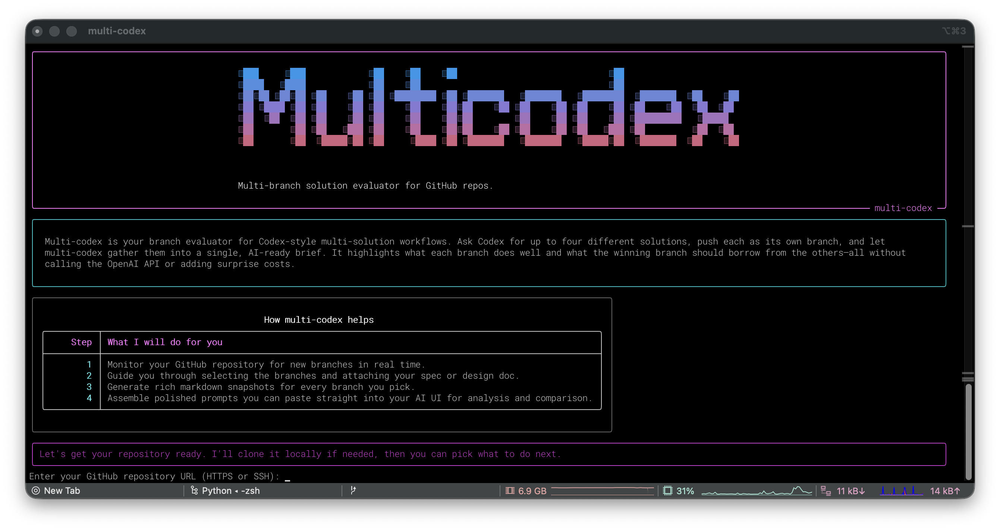

# multi-codex

> [!TIP]
> The next release will include PR analysis and reporting , [please see this issue](https://github.com/faridani/multi-codex/issues/22)

Multi-codex is a Mac CLI companion for multi solution coding workflows. Tools like Codex allow you to produce up to four different solutions for the same feature. Multi-codex helps you compare those solutions, decide which is best, and spot the smart ideas hiding in the other branches so you can fold them into the winner. The typical flow:

1. Ask Codex at `chatgpt.com/codex` for four solutions to your feature.
2. Open pull requests for each solution so Codex produces four branches.
3. Run multi-codex to generate a consolidated report that compares the branches and highlights borrowable improvements.

The tool never calls the OpenAI API (to avoid extra spend on top of the monthly $200), making it a budget-friendly sidekick for solo developers juggling a lot of feature work.

A Mac CLI tool that watches a GitHub repository for new branches, lets you attach specification documents, and produces a single combined prompt you can paste into your AI UI to compare how well each branch satisfies the requirements.



## What the tool does

1. **You run `multi-codex` → CLI appears**: The banner and intro show; it asks for your GitHub repo URL.
2. **GitHub repo address & auth**: Accepts SSH or HTTPS URLs, cloning into `~/.multi_codex/repos/<user_repo>` using your existing Git authentication (works with private repos if `git clone` does).
3. **Monitor branches & attach specs**: Polls `origin` every 30 seconds. When a new branch appears, you’re prompted to add it and optionally provide a path to its specification/requirements document on your Mac. Press **Enter** to skip a spec; press **Ctrl+C** to finish monitoring.
4. **Markdown files per branch + combined doc**: For each selected branch the tool checks out `origin/<branch>`, walks the tree (ignoring large/binary files and common build/IDE directories), and writes `branch_<branch_slug>.md` under `~/.multi_codex/reports/<repo_slug>/`. A combined doc with all specs and branch contents is saved as `combined_spec_and_branches.md`. Its first line is `You are an expert software architect.` so you can copy the whole file directly into your AI chat UI to get the detailed comparison.

## How to run it as `multi-codex` on macOS

### Install as a Python console script (recommended)

The repository already includes a minimal `pyproject.toml`, so you can install and run the tool directly:

```bash
python -m pip install --upgrade pip
pip install .
```

After installation, `multi-codex` is available on your PATH. Use it in any directory with:

```bash
multi-codex
```

## Environment setup

```bash
# Install the tool (includes dependencies)
python -m pip install --upgrade pip
pip install .

# Run
multi-codex
```
